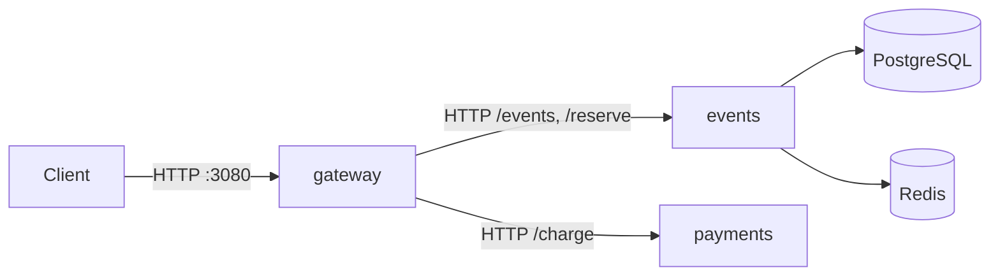

# Lab 1 — SRE Philosophy: Deploy, Break, Understand

## Task 1 — Deploy & Break QuickTicket

### 1.1–1.2: Deploy & Verify

**`docker compose ps`:**

```
NAME             IMAGE                COMMAND                  SERVICE    CREATED              STATUS                        PORTS
app-events-1     app-events           "uvicorn main:app --…"   events     About a minute ago   Up About a minute             0.0.0.0:8081->8081/tcp, [::]:8081->8081/tcp
app-gateway-1    app-gateway          "uvicorn main:app --…"   gateway    About a minute ago   Up About a minute             0.0.0.0:3080->8080/tcp, [::]:3080->8080/tcp
app-payments-1   app-payments         "uvicorn main:app --…"   payments   About a minute ago   Up About a minute             0.0.0.0:8082->8082/tcp, [::]:8082->8082/tcp
app-postgres-1   postgres:17-alpine   "docker-entrypoint.s…"   postgres   About a minute ago   Up About a minute (healthy)   0.0.0.0:5432->5432/tcp, [::]:5432->5432/tcp
app-redis-1      redis:7-alpine       "docker-entrypoint.s…"   redis      About a minute ago   Up About a minute (healthy)   0.0.0.0:6379->6379/tcp, [::]:6379->6379/tcp
```

**Critical path — List events:**

```json
[
    {
        "id": 1,
        "name": "Go Conference 2026",
        "venue": "Main Hall A",
        "date": "2026-09-15T09:00:00+00:00",
        "total_tickets": 100,
        "price_cents": 5000,
        "available": 100
    },
    {
        "id": 4,
        "name": "Python Workshop",
        "venue": "Lab 301",
        "date": "2026-09-22T14:00:00+00:00",
        "total_tickets": 25,
        "price_cents": 2000,
        "available": 25
    },
    {
        "id": 2,
        "name": "SRE Meetup",
        "venue": "Room 204",
        "date": "2026-10-01T18:00:00+00:00",
        "total_tickets": 30,
        "price_cents": 0,
        "available": 30
    },
    {
        "id": 5,
        "name": "Kubernetes Deep Dive",
        "venue": "Auditorium B",
        "date": "2026-10-10T10:00:00+00:00",
        "total_tickets": 80,
        "price_cents": 8000,
        "available": 80
    },
    {
        "id": 3,
        "name": "Cloud Native Summit",
        "venue": "Expo Center",
        "date": "2026-11-20T10:00:00+00:00",
        "total_tickets": 500,
        "price_cents": 15000,
        "available": 500
    }
]
```

**Critical path — Reserve:**

```json
{
    "reservation_id": "b8ddca70-7f4d-4ddc-8ba6-60c393c75278",
    "event_id": 1,
    "quantity": 1,
    "total_cents": 5000,
    "expires_in_seconds": 300
}
```

**Critical path — Pay:**

```json
{
    "order_id": "b8ddca70-7f4d-4ddc-8ba6-60c393c75278",
    "event_id": 1,
    "quantity": 1,
    "total_cents": 5000,
    "status": "confirmed"
}
```

**Health check (all healthy):**

```json
{
    "status": "healthy",
    "checks": {
        "events": "ok",
        "payments": "ok",
        "circuit_payments": "CLOSED"
    }
}
```

### 1.3: Dependency Map



- **gateway** routes all client requests; proxies to `events` for listing, reserving, and confirming tickets, and to `payments` for charging.
- **events** uses **PostgreSQL** for persistent event/ticket data and **Redis** for temporary reservation state (TTL-based expiry).
- **payments** is stateless — no database dependencies.

### 1.4: Failure Table

| Component Killed | Events List | Reserve | Pay | Health Check | User Impact |
|-----------------|-------------|---------|-----|--------------|-------------|
| payments | ✅ Works | ✅ Works | ❌ 502 "Payment service unavailable" | `degraded` (payments: down) | Users can browse and reserve but cannot complete payment |
| events | ❌ 502 "Events service unavailable" | ❌ 502 "Events service unavailable" | ❌ 500 "Payment succeeded but confirmation failed" | `degraded` (events: down) | System fully unusable — no browsing, no reservations; pay charges money but can't confirm |
| redis | ✅ Works | ❌ 504 "Events service timeout" | ❌ 500 "Payment succeeded but confirmation failed" | `degraded` (events: down) | Users can browse events but cannot reserve or pay |
| postgres | ❌ 502 "Events service unavailable" | ❌ Empty response | ❌ 500 "Payment succeeded but confirmation failed" | `degraded` (events: degraded) | System unusable — all write and read paths broken |

### 1.5: Load Generator

**Normal operation (5 RPS, 30s):**

```
QuickTicket Load Generator
Target: http://localhost:3080 | RPS: 5 | Duration: 30s
---
[10s] requests=40 success=40 fail=0 error_rate=0%
[10s] requests=41 success=41 fail=0 error_rate=0%
[10s] requests=42 success=42 fail=0 error_rate=0%
[10s] requests=43 success=43 fail=0 error_rate=0%
[20s] requests=82 success=82 fail=0 error_rate=0%
[20s] requests=83 success=83 fail=0 error_rate=0%
[20s] requests=84 success=84 fail=0 error_rate=0%
[20s] requests=85 success=85 fail=0 error_rate=0%
---
Done. total=123 success=123 fail=0 error_rate=0%
```

**With payments killed mid-load:**

```
QuickTicket Load Generator
Target: http://localhost:3080 | RPS: 5 | Duration: 30s
---
[10s] requests=41 success=39 fail=2 error_rate=4.8%
[10s] requests=42 success=40 fail=2 error_rate=4.7%
[10s] requests=43 success=41 fail=2 error_rate=4.6%
[10s] requests=44 success=42 fail=2 error_rate=4.5%
[20s] requests=82 success=75 fail=7 error_rate=8.5%
[20s] requests=83 success=76 fail=7 error_rate=8.4%
[20s] requests=84 success=77 fail=7 error_rate=8.3%
[20s] requests=85 success=78 fail=7 error_rate=8.2%
[20s] requests=86 success=79 fail=7 error_rate=8.1%
---
Done. total=123 success=114 fail=9 error_rate=7.3%
```

Error rate jumped from 0% to 7.3% after payments was killed — failures accumulated in the second half of the load test window.

---

## Task 2 — Graceful Degradation

### Code Change

```diff
diff --git a/app/gateway/main.py b/app/gateway/main.py
index c86db33..8d94f0e 100644
--- a/app/gateway/main.py
+++ b/app/gateway/main.py
@@ -336,6 +336,15 @@ async def pay_reservation(reservation_id: str):
         raise HTTPException(504, "Payment service timeout")
     except httpx.HTTPStatusError as e:
         raise HTTPException(e.response.status_code, "Payment failed")
+    except httpx.ConnectError:
+        raise HTTPException(
+            status_code=503,
+            detail={
+                "error": "payments_unavailable",
+                "message": "Payment service is temporarily down. Your reservation is held — try again in a few minutes.",
+                "reservation_id": reservation_id,
+            },
+        )
     except Exception as e:
         log.error(f"payment error: {e}")
         raise HTTPException(502, "Payment service unavailable")
```

### Verification (payments down)

**Reserve (works):**

```json
{
    "reservation_id": "afcf2df1-2b36-4c54-b0b9-6d7892a46cc8",
    "event_id": 1,
    "quantity": 1,
    "total_cents": 5000,
    "expires_in_seconds": 300
}
```

**Pay (clear 503):**

```json
{
    "detail": {
        "error": "payments_unavailable",
        "message": "Payment service is temporarily down. Your reservation is held — try again in a few minutes.",
        "reservation_id": "TEST"
    }
}
```

---

